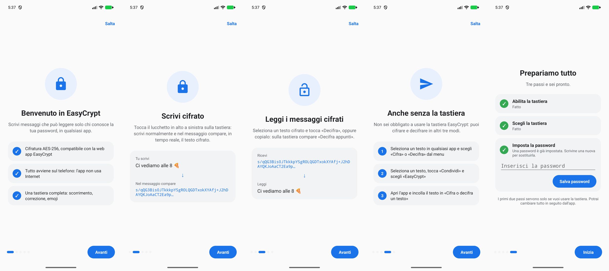

<div align="center">


# EasyCrypt Keyboard

**La tastiera Android che cifra mentre scrivi.**

Aspetto e gesti di Gboard, con in più un lucchetto: lo tocchi e ciò che digiti arriva nel messaggio già cifrato.

</div>

---



## Cosa puoi fare

### Scrivere cifrato

Tocca il **lucchetto** in alto a sinistra sulla tastiera. Da quel momento scrivi normalmente: il testo in chiaro
lo vedi nella barra della tastiera, mentre nel campo dell'app (WhatsApp, Telegram, email…) compare in tempo reale
il testo cifrato.

### Leggere un messaggio cifrato

- **Seleziona il testo** in un campo di scrittura: sulla tastiera compaiono «Decifra» e «Cifra».
- **Copia il testo**: sulla tastiera compare «Decifra appunti».

### Anche senza usare la tastiera

Non sei obbligato a tenere EasyCrypt come tastiera:

1. **Menu di selezione** — seleziona un testo in qualsiasi app e scegli «Cifra» o «Decifra» (a volte sotto i
   tre puntini). Funziona anche sul testo non modificabile, come i messaggi ricevuti.
2. **Condividi** — seleziona un testo, tocca «Condividi», scegli «EasyCrypt» e poi «Cifra» o «Decifra».
3. **Pagina dell'app** — apri l'app, tocca «Cifra o decifra un testo» e scrivi o incolla.

> Alcune app (ad esempio Google Keep) non mostrano «Cifra» e «Decifra» nel menu di selezione: in quel caso usa
> «Condividi» oppure la pagina dell'app.

### Una tastiera completa

| Funzione | Come si usa |
|---|---|
| Digitazione a scorrimento | Traccia la parola da una lettera all'altra; lo spazio si aggiunge da solo |
| Correzione automatica (T9) | Tre suggerimenti sopra i tasti; corregge con spazio o punteggiatura, «cancella» subito dopo annulla |
| Sposta il cursore | Scorri sulla barra spaziatrice |
| Cancella parole intere | Scorri a sinistra dal tasto cancella: le parole si selezionano, al rilascio vengono eliminate |
| Lettere accentate | Tieni premuta la lettera |
| Emoji | Per categoria, con «Usate di recente» |
| Riga dei numeri | Attivabile dall'app |
| Vibrazione | Attivabile dall'app |
| Altezza dal bordo | Regolabile dall'app |
| Tema | Chiaro o scuro, segue il telefono |

Il dizionario italiano (circa 165 000 parole) è dentro l'app; le parole che scegli di tenere vengono imparate.

## Installazione

1. Scarica l'APK dall'ultima [release](https://github.com/carellice/easy-crypt/releases/latest) e installalo (Android 8.0 o successivo).
2. Apri l'app: l'introduzione ti guida nei tre passi — **abilita** la tastiera, **sceglila**, **imposta la
   password**.
3. Chi riceve i tuoi messaggi deve usare la stessa password.

## Privacy

- L'app **non ha il permesso di accedere a Internet**: l'unico permesso richiesto è la vibrazione.
- La password resta sul telefono, cifrata con una chiave dell'Android Keystore.
- Dizionario, emoji e parole imparate sono salvati solo sul dispositivo.

---

## Per sviluppatori

### Requisiti

- Android Studio (o Android SDK 36) e un JDK 17+; va bene quello incluso in Android Studio.
- Nessuna libreria esterna: solo SDK Android e Kotlin (`minSdk` 26, `targetSdk` 36).

### Compilare

```bash
JAVA_HOME="/Applications/Android Studio.app/Contents/jbr/Contents/Home" ./gradlew installDebug
```

```bash
JAVA_HOME="/Applications/Android Studio.app/Contents/jbr/Contents/Home" ./gradlew testDebugUnitTest
```

### Script (Mac)

| Script | Cosa fa |
|---|---|
| `Avvia su emulatore.command` | Avvia l'emulatore `Pixel_10_Pro`, compila, installa e attiva la tastiera |

La pubblicazione si fa con `Pubblica release.command` nella cartella principale, che crea anche i pacchetti per
Mac e PC. La versione è in `version.properties`. L'APK di release è firmato con la chiave di debug del Mac che lo compila.

### Cifratura

PBKDF2-HMAC-SHA256 (100 000 iterazioni) → AES-256-GCM, output `base64(salt[16] + iv[12] + ciphertext + tag)`:
lo stesso formato della web app EasyCrypt e della [versione per Mac e PC](../EasyCrypt-Mac-PC/README.md).

Per cifrare a ogni tasto senza rallentare, la tastiera deriva la chiave una volta per sessione (salt fisso per
la sessione, IV nuovo a ogni cifratura) e ne prepara una di riserva su un thread separato.

### Struttura del codice

`app/src/main/java/com/easycrypt/keyboard/`

| File | Ruolo |
|---|---|
| `EasyCrypt.kt` | Algoritmo di cifratura |
| `EasyCryptIME.kt` | Servizio della tastiera: scrittura cifrata, decifratura, suggerimenti, emoji |
| `KeyboardView.kt` | Tastiera disegnata su Canvas: tasti, anteprime, gesti, scorrimento |
| `KeyboardLayouts.kt`, `KeyboardTheme.kt` | Disposizione dei tasti e colori chiaro/scuro |
| `Autocorrect.kt` | Correzione, suggerimenti, riconoscimento delle parole tracciate, parole imparate |
| `Prefs.kt`, `PasswordStore.kt` | Opzioni e password (Android Keystore) |
| `SettingsActivity.kt` | Schermata principale dell'app |
| `OnboardingActivity.kt` | Introduzione del primo avvio con configurazione guidata |
| `TextCryptActivity.kt` | Pagina «Cifra o decifra un testo» |
| `ProcessTextActivity.kt` | «Cifra»/«Decifra» dal menu di selezione e testo condiviso |

Test in `app/src/test/`: `EasyCryptTest.kt` (compatibilità con la web app) e `GestureTest.kt` (precisione dello
scorrimento su tracciati simulati).

### Dati inclusi

| File | Origine |
|---|---|
| `app/src/main/assets/words_it.txt` | Generato da `tools/build_dictionary.py` a partire da `it_full.txt` di [FrequencyWords](https://github.com/hermitdave/FrequencyWords) (MIT; dati OpenSubtitles, CC BY-SA 4.0) e dagli elenchi di [paroleitaliane](https://github.com/napolux/paroleitaliane) (MIT) |
| `app/src/main/assets/emoji.txt` | Generato da `tools/build_emoji_asset.py` a partire da `emoji-test.txt` di Unicode 15.1 |
| `icon/` | Icona dell'app in PNG (quadrata, arrotondata, tonda) |

Lo stile delle emoji nel pannello si può cambiare dall'app scegliendo un file di font emoji presente sul
telefono; riguarda solo come appaiono nella tastiera, non nel testo inviato.
